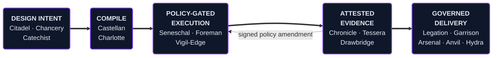
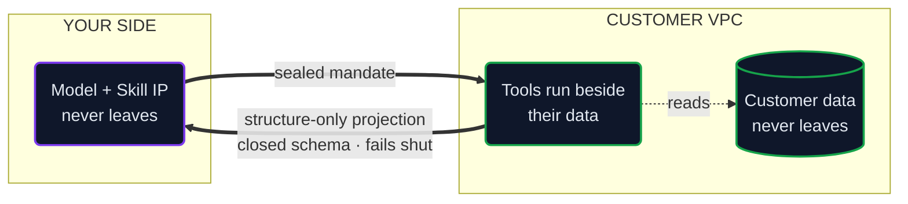

# Tim Wolfe

### AI Governance Infrastructure

**I build the compilers, runtime authority, and attestation substrate that make AI agents safe to deploy**
*in environments that cannot tolerate a mistake — defense, federal, healthcare, financial services.*

 

 

 

Los Altos, CA&nbsp; ·&nbsp; [rtwolfe@gmail.com](mailto:rtwolfe@gmail.com)&nbsp; ·&nbsp; 650-390-5003&nbsp; ·&nbsp; [LinkedIn](https://linkedin.com/in/timwolfe)

---

## The Pipeline

> Governance is not a layer added at the end. It is the thing being compiled, enforced, and proven at every step — each stage consuming the previous stage's **signed** output.

---

## Design-Time Compilers

| System | What it does |
|---|---|
| **Castellan** | Agent governance compiler. A declarative spec compiles into a signed, provenance-carrying agent with its governance contract **embedded in the emitted code** — twelve export targets, from the major provider SDKs and LangGraph/CrewAI/AutoGen to Level-6 hardened Rust. Inline guardrails resolve on most-restrictive-wins precedence, so composing two policies can only tighten the result, never loosen it. A CI gate blocks merges that regress governance. |
| **Charlotte** | Context engineering compiler. Prompts, agent skills and MCP servers built through one typed pipeline with a 103-block catalog and context-window packing. Emits SHA-384 tool-integrity hashes the runtime re-verifies at call time, plus a design-time scanner grading tool descriptions for poisoning and rug-pull patterns. |
| **Citadel** | Compiles behavioral intent into enforceable runtime policy, then scans the live codebase against dozens of framework profiles — FedRAMP SSP with POA&M, NIST 800-171 with SPRS scoring, DISA STIG, ISO 42001, CycloneDX AI SBOM. |
| **Catechist** | Prompt design with provenance. Every spec carries a provenance block that `replay`, `counterfactual`, `explain` and `diff` all read from — a prompt's lineage is reconstructable, not remembered. |

## Runtime Authority

> **No model anywhere in the decision path.** Enforcement is deterministic code, which is why it is testable, replayable, and explainable to an auditor.

| System | What it does |
|---|---|
| **Seneschal** | On-premises Rust policy authority. Every tool call and cross-agent message clears a deterministic **30-check gate** — identity, authorization, attestation, delegation, rate limit, kill switch, tool integrity. FIPS 140-3, single static binary, zero external dependencies, signed on every decision. |
| **Foreman** | Agent loops under containment. Coding agents run in **kernel-level sandboxes** alongside their MCP servers, under hard ceilings on turns, wall time and token spend. Completion is judged by a **verifiable predicate** — the symbol must exist *and* be referenced outside its own definition — never by the agent's claim to be finished. Network isolation is the default; reaching a hosted model is an explicit opt-in recorded in the run. |
| **Vigil-Edge / Barbican** | Behavioral monitoring that runs *beside* a deployment, never inside it, so the monitor can never take down what it watches. Builds a per-agent behavioral fingerprint, scores drift, and pushes **signed policy amendments** back to the gate — enforcement adapts at runtime with no redeploy. |

## Attestation & Evidence

| System | What it does |
|---|---|
| **Chronicle** | The evidence layer. Canonicalized, hybrid post-quantum signed events in a Merkle-chained ledger, with a control-mapping engine that fans one runtime event out to **every framework control it satisfies**. Exports auditor-shippable OSCAL and ATO bundles across commercial, regulated and sovereign tiers, with reproducible builds a customer can re-derive. Zero LLMs in the compliance-critical path. |
| **Tessera** | **The blind seam.** Per-call gates judge one call at a time — so when an action begins as an A2A hand-off and finishes as an MCP tool call, the causal thread is cut at the boundary. *Every step can be legal while the chain is not.* Tessera stitches tool calls and agent hand-offs into one causal chain across that boundary and scores the chain against **declared authority**, catching runaway delegation, unattributable callers, effective authority exceeding declared, and tools whose schema changed after approval. |
| **Drawbridge** | Governed agent-to-agent transport. Every inter-territory message signed, encrypted, attested and policy-gated before it touches the wire — three independent signature foundations, per-message forward secrecy, hardware-bound identity checked against revocation at the gate. |

## Governed Delivery & Sovereign Deployment

> **The inversion:** the IP never leaves because the inference never sees the data.

| System | What it does |
|---|---|
| **Legation** | Run your own agents and MCP servers **inside someone else's VPC**. The data flow is inverted: inference and skill IP stay with the operator, the tools run beside the customer's data, and only structure-only projections cross back — validated against a closed, versioned egress schema that **fails shut** on anything it does not recognize. *The customer's data never leaves because the model never sees it.* One hardening dial from commercial bolt-on to DoD sovereign. |
| **Arsenal** | Thirty hardened Rust MCP servers across fifteen security domains, query-only by construction, with domain knowledge compiled into the binary — nothing touches disk, runs air-gapped in a SCIF. |
| **Anvil** | DoD-grade agentic coding harness with exactly **one compile-enforced path** from proposed action to execution, un-bypassable by construction and degrading toward deny. Swappable inference backend: hosted in development, local model in the enclave, GovCloud when connected. |
| **Hydra** | Egress gateway that classifies every payload before it crosses the boundary and routes to in-enclave, GovCloud or commercial providers behind a human approval gate **bound to the exact decision it authorized**. |
| **Garrison** | The hardened operator console customers run. Single-operator Level-6 Rust shell hosting compiled agent binaries behind a **closed allowlist** — only attested, licensed binaries load. Four tiers from hosted to sovereign. |
| **Cutout** | Sovereign-tier post-quantum point-to-point transfer. Two parties, one file, nothing in between — no Tor, no central server in the data path, **no third party to compel**. Hardware-bindable identity via TPM 2.0. |

---

<b>Agentic Product &amp; Delivery</b> — the product organization, built as software

 

| System | Role |
|---|---|
| **Chancery** | *Chief Product Officer.* Compiles unstructured input — voice transcripts, Slack threads, meeting notes — into complete PRDs through a code-enforced four-phase, three-gate workflow, then compiles the approved PRD into a build bundle with drop-in packs for the major AI coding engines. **Architect mode** decomposes a raw customer scenario into the minimum correct set of agents and MCP servers with ceiling-aware sizing, every candidate architecture validated by the Castellan and Charlotte compilers *at design time*. |
| **Steward** | *Product Owner.* Backlog intelligence across Jira, Confluence, GitHub, Slack and Teams — a day-two engagement brief and sixteen product antipattern detectors, each with a confidence floor and severity tier. |
| **Verity** | *Scrum Master.* Delivery intelligence under a two-signal-minimum evidence floor: blocked work invisible on the board, Monte Carlo completion forecasts from real velocity, the full ceremony cadence. Read-only by construction. |
| **Author** | Story authoring on a deterministic grader with **no model in the gate path**. |
| **Reeve** | Governed Atlassian writes — change request → impact analysis → approval gate → governance token, every change snapshotted and reversible. |

**Measured on client engagements:** PRD cycle time from two weeks to three days across eight products · onboarding from three weeks to a day-two brief across five engagements · first-pass story quality from 60% to over 90%, cutting sprint-planning rework from 20–30% of the backlog to under 5%.

<b>Quality &amp; Release Verification</b>

 

| System | What it does |
|---|---|
| **Aardvark** | Agentic QA intelligence engine. Reasons about a repository, determines which checks it actually requires, and runs them across thirteen categories **ranked by business consequence** — requirement coverage first, then secrets, dependencies, SAST, containers, infrastructure-as-code, test coverage, licensing. Reports what it did *not* check as prominently as what it found; a stage that cannot run returns inconclusive and never a pass. |
| **Discovery** | Release verification for coding-harness deliveries. Point it at the PRD, the delivered repository, and the baseline it started from: every requirement graded against the code, every finding attributed as **introduced / inherited / fixed**, ending in one release-readiness decision. |

---

**Python where iteration speed matters · Rust where blast radius does**

System-by-system technical detail → **[PLATFORM-DETAIL.md](PLATFORM-DETAIL.md)**

